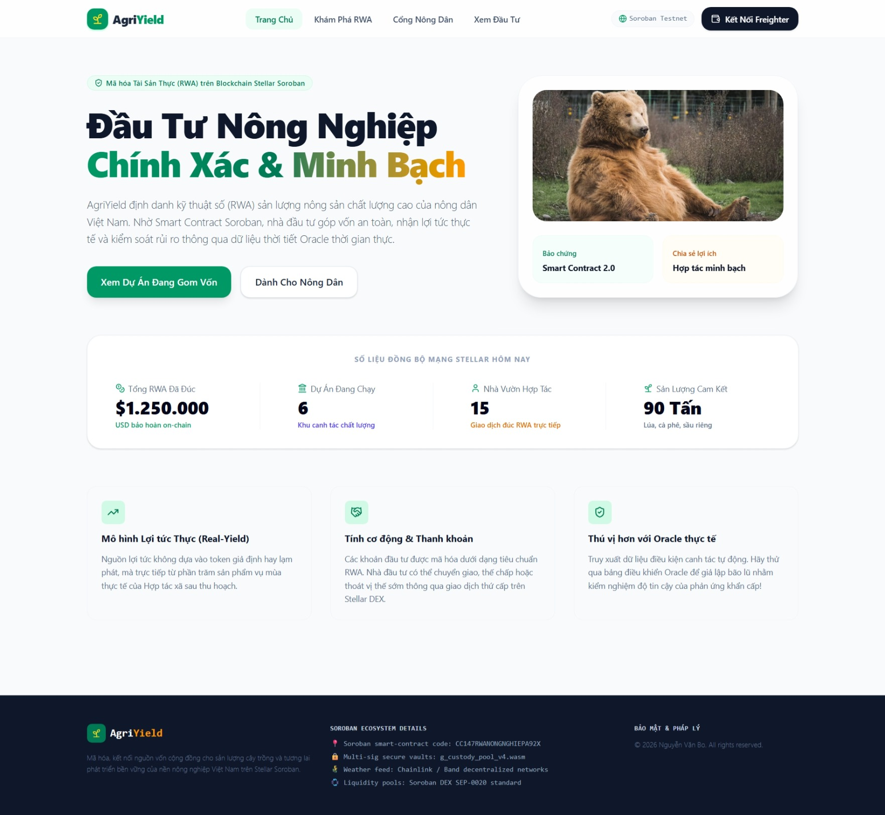

# 🌱 AgriYield

### *Decentralized Real World Asset (RWA) Crowdfunding and Yield Distribution for Sustainable High-Tech Agriculture in Vietnam*

---

[](https://stellar.org)
[](https://stellar.org)
[](https://react.dev)
[](https://tailwindcss.com)

**AgriYield** is a cutting-edge decentralized web application designed to bridge the gap between global Web3 capital and high-tech sustainable agriculture. By focusing on the rich farming regions of Vietnam (such as the Mekong Delta and Dong Thap), AgriYield permits local farmers to tokenize their upcoming crop cycles into tradable Real World Assets (RWA), enabling fractional crowd-funding from global investors while assuring automated, non-custodial, and trustless yield distribution upon harvest.

---

## 🚀 Key Features

### 💼 For Web3 Investors
*   **Fractionalized RWA Investment:** Participate in lucrative, high-tech agricultural ventures in Southeast Asia with as little as a few USDC.
*   **Real-Time Yield Tracker:** Automatically track expected annual percentage yields (APR) and project timelines directly inside an intuitive personal dashboard.
*   **Guaranteed Principal & Yield Return:** Multi-signed on-chain vaults lock and distribute funds according to contract parameters, completely bypassing middlemen.

### 🚜 For Local Farmers
*   **Agile Capital Minting:** Package raw agricultural cycles (e.g., high-tech dragon fruit, clean hydroponic lettuce, organic mangoes) into smart contract campaigns to easily raise capital.
*   **Secure Escrows:** Funds are disbursed to farmers upon successful campaign completion to procure farming supplies, smart sensors, and advanced fertilizers.
*   **Streamlined Yield Submission:** Submit post-harvest revenues directly back into the pool, maintaining high trust ratings and building historical credibility on the chain.

### 🔮 Technical Oracle Integration & Simulations
*   **Dynamic Smart Assets:** Interactive oracle controls simulate live agricultural inputs, demonstrating how the dApp adjusts to:
    *   *Sudden Weather Alerts:* Adapting to rain/drought simulations that might delay harvest phases.
    *   *DEX Market Price Shifts:* Real-time fluctuations in agricultural commodity index prices that recalculate expected collateral and APR on the fly.

---

## ⛓️ Smart Contract Architecture (Soroban Rust)

At the heart of the AgriYield platform is an optimized Soroban Smart Contract written in Rust, running on the **Stellar Testnet**. The contract maintains a rock-solid, state-driven lifecycle for every RWA project to protect both farmers and investors.

```
       [ Farmer Mints ]
              │
              ▼
   ┌──────────────────────┐
   │     Funding (0)      │◄── Investors deposit USDC
   └──────────┬───────────┘
              │  (Target Met)
              ▼
   ┌──────────────────────┐
   │     Farming (1)      │◄── Farmer utilizes funds for crop cycle
   └──────────┬───────────┘
              │  (Harvest Completed)
              ▼
   ┌──────────────────────┐
   │    Harvested (2)     │◄── Yield & Revenue reported by Farmers / Oracles
   └──────────┬───────────┘
              │  (Distribute Triggered)
              ▼
   ┌──────────────────────┐
   │    Distributed (3)   │◄── Capital + Crop Profits disbursed to Investors
   └──────────────────────┘
```

### Core Project States (`enum ProjectStatus`)
*   `0: Funding` — The initial phase. Investors can stream USDC contributions until the milestone budget target is satisfied.
*   `1: Farming` — The capital is unlocked to the farmer's address. The crop is physically cultivated.
*   `2: Harvested` — Crops are sold. Revenue is verified, deposited back into the smart contract's custody, and prepared for proportional payouts.
*   `3: Distributed` — Crop cycles are concluded. Investors successfully reclaim their principal alongside the generated agricultural yield.

### Rust Smart Contract Core Functions
*   `init(admin: Address, usdc_token: Address)`: Instantiates contract parameters, configuring secure admin multi-sigs and white-listed collateral stablecoins.
*   `create_project(farmer: Address, title: String, target_amount: i128, apr_bps: u32, duration_blocks: u32)`: Allows authorized farmers to mint a new RWA project. APR is specified in basis points (1% = 100 bps) to maintain fixed-point arithmetic precision.
*   `invest(investor: Address, project_id: u32, amount: i128)`: Checks status and transfer allowances, shifting USDC from the investor's balance to the project's Soroban escrow wallet. Automatically upgrades the state to `Farming` once the funding target is fulfilled.
*   `update_status(project_id: u32, new_status: u32)`: Authorized state transitioners advance projects from Farming to Harvested, preventing rogue state locking.
*   `distribute_yield(project_id: u32, total_revenue: i128)`: Pro-rata distribution engine. Computes fraction shares:
    $$\text{Payout} = \text{Principal} + \left( \text{Deposit} \times \frac{\text{APR}}{10000} \right)$$
    The contract instantly streams the liquid stablecoins to global investor addresses.

---

## 🛠️ Tech Stack Breakdown

The AgriYield dApp is architected with modern industry standards to guarantee exceptional performance, absolute type safety, and an elegant responsive layout:

*   **Frontend Engine:** React 19, TypeScript 5 (Strict mode) for building robust component architectures.
*   **Web3 Integration:** 
    *   `@stellar/stellar-sdk` — To compile transactions, simulate execution fees, and configure Soroban RPC clients.
    *   `@stellar/freighter-api` — Direct Freighter Wallet communications to handle public key assertions and cryptographic transaction signing.
*   **Styling & Motion:** 
    *   Tailwind CSS v4 — Featuring custom fluid theme systems, modern container layouts, and responsive panels optimized across mobile and desktop.
    *   `Framer Motion` / `Motion` — For smooth transitions, staggered grid layouts, and immersive visual transaction status popups.
*   **Material Icons:** `lucide-react` for clean, consistent corporate fintech imagery.

---

## 📦 Local Installation & Setup

Get AgriYield up and running locally in your development environment inside 3 minutes.

### Prerequisites
*   [Node.js](https://nodejs.org) (v18.0 or newer recommended)
*   An active Stellar [Freighter Wallet](https://www.freighter.app/) extension installed on your Google Chrome, Brave, or Firefox browser.

### Step 1: Clone and Install Dependencies
```bash
# Clone the repository
git clone https://github.com/your-username/agriyield.git
cd agriyield

# Install node dependencies
npm install
```

### Step 2: Set Up Freighter Wallet for Soroban Testnet
1.  Open your **Freighter Wallet Extension**.
2.  Click the Settings gear icon (Settings) -> **Preferences** -> **Network**.
3.  Ensure your default network is set to **Test Net**.
4.  Navigate to the [Stellar Laboratory Friendbot](https://laboratory.stellar.org/#account-creator?network=testnet) to fund your wallet address with free testnet XLM for gas fees.

### Step 3: Spin Up Development Server
```bash
npm run dev
```
The server will boot up and bind to host `0.0.0.0` at port `3000`. You can preview the running application at:
🌐 **`http://localhost:3000`**

---

## 💳 Frontend-to-Wallet Transactions Workflow

Traditional Web3 extensions often suffer from iFrame security blocking or unresponsive script timeouts. AgriYield overcomes this by implementing a highly reliable **Simulation -> Freighter Popup Approval -> RPC Broadcast** pattern:

```
  [ User Actions ]
  (e.g., Click 'Invest')
         │
         ▼
  [ Stellar Transaction Built ] 
  Using @stellar/stellar-sdk 
         │
         ▼
  [ Soroban Simulation Engine ]
  Calculates actual network footprints & storage gas fees (XLM)
         │
         ▼
  [ Freighter Extension Popup ] <── Decoded window queries Freighter securely
         │
    ┌────┴──────────────┐
    ▼ (Approve)         ▼ (Reject/Cancel)
  [ Hash Signed ]    [ Transaction Aborted ]
  Transaction XDR    Cleans modal states, alert warning shown
         │
         ▼
  [ Soroban RPC Broadcast ]
  Sends envelope to Stellar Testnet validator nodes
         │
         ▼
  [ Success State Synchronized ]
  Updates balances & displays "Xác Thực Thành Công" visual animations
```

This pattern ensures that users with browser restrictions can choose to bypass the container iFrame by clicking **"Mở dApp Trong Tab Mới" (Open dApp in a New Tab)**, satisfying both security policies and smooth user operations.

---

## 👥 Team & License

*   **Principal Authors:** AgriYield Dev Team.
*   **License:** Proprietary. © 2026 AgriYield Dev Team. All rights reserved. Registered for the Vietnam Web3 Innovation Hackathon.

---
*Created with 💚 for farmers and sustainable global investors.*
---

## Contract Detail

ID: CD34PIOLISQPJWNBUJFE6FYZNQVFIDZHC2KBXGTVHI5HMWDGSFWWTNTP

---


